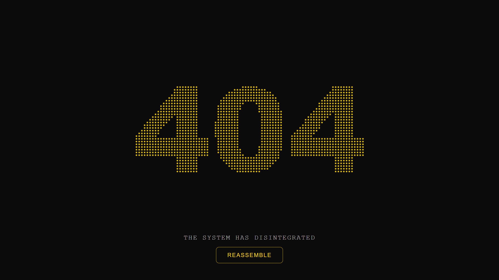
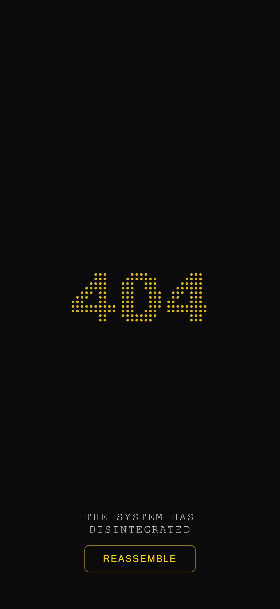
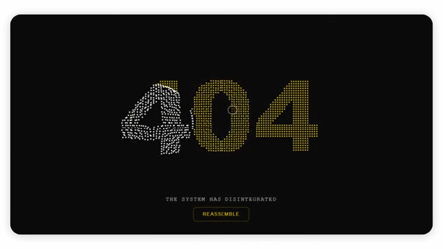

  

<h1 align="center"><a href="https://notfoundpages.github.io/404-particle-reassembly-classic">404-particle-reassembly-classic</a></h1>

  An interactive particle-based 404 error page where the error message
  disintegrates and reassembles into a glowing particle formation.

<h3 align="center">
  <a href="https://notfoundpages.github.io/404-particle-reassembly-classic">Live Demo</a>
  ·
  <a href="https://github.com/notfoundpages/404-particle-reassembly-classic">Source Code</a>
  ·
  <a href="https://github.com/notfoundpages/404-particle-reassembly-classic/issues">Issues</a>
</h3>

## Overview

A 404 page doesn't have to feel like an error.

**404 Particle Reassembly Classic** turns a missing page into an interactive particle experience. The 404 message breaks apart into glowing particles, reacts to the user's cursor or touch, and can smoothly reassemble on demand.

Built entirely with **HTML, CSS, and vanilla JavaScript**, the page uses the native Canvas API to render and animate the particle system with no frameworks, no dependencies, and no build step.

Just copy it into your project, customize it, and give your visitors a memorable error page.

## Preview

| Desktop | Mobile |
| ------- | ------ |
|  |  |

<table width="100%">
  <tr>
    <td width="50%" align="left" valign="middle">
      
    </td>
    <td width="50%" align="left" valign="middle">
      The background is powered by a Canvas-based particle system that
      transforms the 404 message into a dynamic field of glowing particles.
      Particles respond to pointer movement and touch interaction before
      smoothly returning to their original positions when reassembled.
    </td>
  </tr>
</table>

## Quick Start

### GitHub Pages

Using it with **GitHub Pages** is simple:

1. Rename `index.html` to `404.html`.
2. Keep `404.html` in the **root** of your repository.
3. If using the external version, keep `style.css` and `script.js` alongside it.
4. Commit and push your changes.

GitHub Pages automatically serves a root-level `404.html` when a visitor reaches a page that doesn't exist.

### Other Hosting

For other hosting platforms, rename `index.html` to `404.html` and upload it to your website's public or root directory.

If you're using the external version, upload `style.css` and `script.js` alongside it.

Most hosting platforms automatically serve `404.html` for missing pages. If yours requires additional configuration, check your hosting provider's documentation for setting a custom 404 page.

### Inline Version

Prefer a single file?

Use either `inline/index.html` or the minified `inline/index.min.html`.

Simply copy the contents into a new `404.html` in your repository or hosting root and you're ready to go — no external CSS, JavaScript, or additional files required.

  <strong>Made with ❤️ by <a href="https://notfoundpages.github.io">Not Found Pages</a></strong>

  Give your visitors something better than a dead end.

